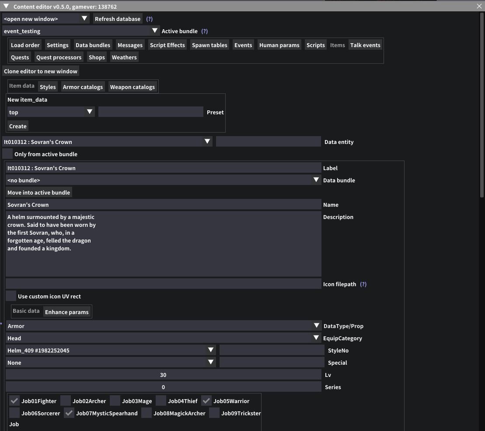

# DD2 Content editor

Real-time ingame data editor for DD2 (and possibly other RE engine games). Can theoretically edit any accessible game data with the right addon support, while also providing a common reusable UI framework.

The default launch only contains the content database without editor support. Users who wish to actually edit things can enable it through the button in the ingame REF UI, in the content database section. It is disabled by default to speed up gameplay and launch times, may be more or less noticeable depending on machine.

The mod is basically an "Any game data" JSON-serialization based editor. As long as reading and inserting data into the game is implemented through a lua addon, any data can be edited instead of going through .user files. This makes any changes mostly version-agnostic and reduces mod conflicts when many things share the same file, also much easier to review changes compared to raw RSZ files. The mod automatically prepares a UI for displaying any game class via IMGUI similar to alphaZomega's EMV Engine console, except simplified for only editable data while also allowing customization of the data presentation, extending it with custom features specific to an object type. I've made adding new editors and addons as straightforward as I could so anyone else is welcome to contribute.

Usage documentation is available in the [wiki pages](https://github.com/kagenocookie/dd2-content-editor/wiki).

## Requirements
- [REFramework](https://github.com/praydog/REFramework): hard requirement. In case of issues, try installing the latest nightly version.
- [Fluffy mod manager](https://www.fluffyquack.com/): I highly recommend using the mod manager instead of manually installing unless you know what you're doing.
- [EMV-Engine/Console](https://github.com/alphazolam/EMV-Engine): optional, can help with discovering things that may not be exposed by the mod yet.

## Why?
Due to RE engine games often storing many objects in a single catalog file, it's hard to use existing desktop tools for editing some files directly because of nested objects and references to other files, also conflicts between mods editing different objects within one of these files are pretty much unresolvable. Adding custom things also generally isn't possible at all without some runtime patching since a lot of object IDs are hardcoded. This mod does that, ingame (meaning the actual files are left clean in the game folder) and in real-time (meaning that we can dynamically alter them while the game is running, like changing NPC behaviors etc).

## Setup
- Download the latest version from releases
- Pre-release versions can be downloaded from [here](https://github.com/kagenocookie/dd2-content-editor/actions).
- Drop __one__ of the ZIPs for your game as a mod into Fluffy mod manager
    - The "core" release is intended to work for any REF-enabled game and has no game specific editors
- Activate the individual addons you wish to enable, and you're ready to go
- Place some bundle json files into the `GAMEDIR/reframework/data/usercontent/bundles` folder or create them through the editor

## DD2 editors current status
- ✔️Functional: Create and edit events (escorts, monster culling requests, affinity escorts) [Info](https://github.com/kagenocookie/dd2-content-editor/wiki/Events)
- ✔️Functional: Create and edit items (custom consumables, armor, weapons) [Info](https://github.com/kagenocookie/dd2-content-editor/wiki/Items)
- ✔️Functional: Shops editor
- ✔️Functional: Weathers editor
- ✔️Functional: Human parameters (augments, jobs, other misc settings)
- ✔️Functional: NPC data (outfits, appearance, jobs, misc settings)
- PoC: Enemy data
- PoC: Chest data
- PoC: AI data viewer
- PoC: Sound viewer
- On hold, partial support: Quest editor (see [Info](https://github.com/kagenocookie/dd2-content-editor/wiki/Quests))
- On hold, partial support: Dialogue editor

## Current editor features
- All custom data is stored in bundle json files that may contain any number of different entity types
- Full data JSON serialization support - as long as a content addon knows where to store relevant data
- Can be easily extended via lua addons to support additional data
- General: Support for custom lua scripts to be executed on supported objects
- General: Modify/override any translation strings (message guids)

## Is this safe to use?
Depends on the mods running. Anything that gets sent online could get you banned from online features. I highly recommend making a save backup before installing new mods because there might be issues I just haven't encountered yet that may make your save no longer load up, maybe if the game updates in a way that things that worked before, end up breaking.

## Content editor development setup
- clone the repository
- symlink `content_editor/`, `content_editor.lua` and `<gamename>/editors/` into your game's reframework/autorun folder, as well as the individual game specific editors into the root autorun folder
    - The expected structure would be `autorun/content_editor/*`, `autorun/editors/*`, `autorun/editor_items.lua`, ...
- copy the core usercontent files from the mod into your game's data/usercontent/ directory (not symlinked so you can still have non-core addons and presets installed)
- ideally, install the LuaLS extension by sumneko
- for proper game type references, setup the `Lua.workspace.library` workspace setting if using vscode, or whatever equivalent your IDE of choice supports, with the output of e.g. https://github.com/kagenocookie/REFDumpFormatter

## Credits
- [praydog](https://github.com/praydog/REFramework) for REFramework itself
- [alphaZomega](https://github.com/alphazolam) for his EMV Engine tools which have been invaluable in researching game runtime data
